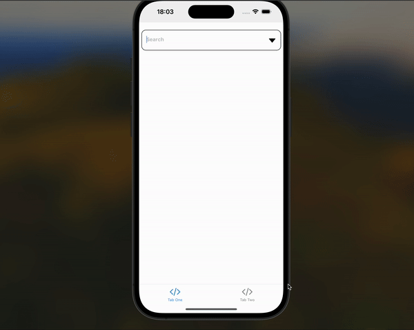

# 7Apps React - React Native Developer Case Study

## Multi-Select Autocomplete Component

This project is a multi-select autocomplete component implemented using React Native, designed to search for characters in the "Rick and Morty" API. The application follows the provided design and meets all specified requirements.

## Features

- **Expo and Expo Router with Typescript**
- Multi-select implementation according to the provided design
- Query input field to search with the Rick and Morty API
- Display character image, name, and number of episodes in the search results
- Highlight the entered query word in the listed results
- Add and remove selected results to/from the input field
- Loading state indication
- Exception handling and error states displayed in the interface

## Technologies Used

- **React Native**
- **Expo**
- **Expo Router**
- **Typescript**
- **NativeWind**
- **TanStack Query v5**
- **Zustand**

## Usage

- **Search**: Start typing in the search field to query the Rick and Morty API.
- **Select**: Click on a character to select them; they will appear in the input field.
- **Remove**: Click on a selected character in the input field to remove them.

## Screenshots

## API

- **API**: [Rick and Morty API](https://rickandmortyapi.com/)
